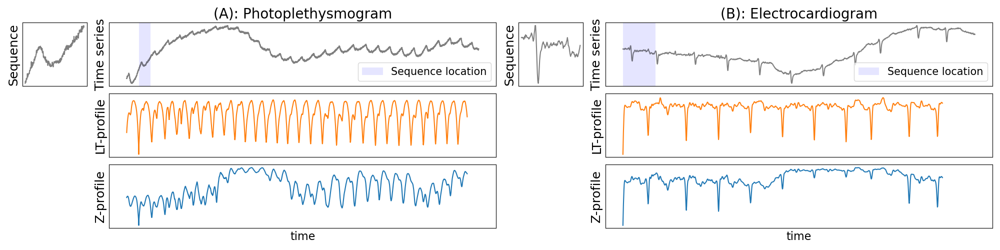

<h1 align="center">LT-normalized Euclidean distance, a novel distance invariant to linear trend for time series data mining</h1>

<div align="center">
<p>
 
</p>
</div>


## Abstract

The Z-normalized Euclidean distance is considered the reference distance in many time series data mining tasks, due to its good computational properties and its invariance to amplitude and offset shifts. However, the presence of a trend in a time series may cause changes in the shape of subsequences that are not taken into account by the Z-normalized distance, making the similarity measure less reliable. In this article, we introduce a new distance called LT-normalized Euclidean distance (LT stands for Linear Trend), which is invariant to linear trend, amplitude, and offset shifts. It generalizes the Z-normalized distance by removing the linear trend and scaling the subsequences to unit variance. Like the Z-normalized distance, we show that the LT-normalized distance has a computationally efficient recursive formulation. Thanks to this recursion property, the LT-normalized matrix profile can be computed with the same quadratic complexity as the classical Z-normalized matrix profile with minor modifications to state-of-the-art standard algorithms. Empirical results on synthetic and real datasets show that the LT-normalized distance outperforms the Z-normalized distance for the best motif pair, similarity search, and motif set discovery problems.

<p align="center">
  
  <figcaption>Similarity search on: (A) photoplethysmogram, and (B) electrocardiogram. In both cases, top left: the query subsequence, top right: the time series with the query subsequence location in blue, middle: LT-normalized distance profile, bottom: Z-normalized distance profile. Due to the trend, some occurrences of the query subsequences are missed with the Z-normalized distance profile while they are all identifiable with the LT-normalized distance profile.</figcaption>
</p>


## Functionalities

- Paper's experimental results can be found in the jupyter notebook [experiment_results_paper.ipynb](https://github.com/thibaut-germain/lt-normalized/blob/main/experiment_results.ipynb)
- Paper's illustration can be found in the jupyter notebook [paper_illustration.ipynb](https://github.com/thibaut-germain/lt-normalized/blob/main/paper_illustration.ipynb)
- Similarity search or best motif pair experiments can be run directly from the jupyter notebook [experiment_results_paper.ipynb](https://github.com/thibaut-germain/lt-normalized/blob/main/experiment_results.ipynb)
- To run motif discovery or scalability experiment, use the following command from the root folder:
  ```(bash)
  python experiment/script_<expname>.py
  ```
  If all experiments are re-run, the new results can be displayed with the jupyter notebook [exp_results_paper.ipynb](https://github.com/thibaut-germain/lt-normalized/blob/main/experiment_results.ipynb)


## Prerequisites

1.  download and unzip the datasets at the root folder from the following archive:

```(bash) 
https://drive.google.com/file/d/1tfOXKbk7rhAqF4jzuMkrgklcYU3qtWzY/view?usp=sharing
```
2. All python packages needed are listed in [requirements.txt](https://github.com/thibaut-germain/lt-normalized/blob/main/requirements.txt) file and can be installed simply using the pip command: 

```(bash) 
conda create --name perspa --file requirements.txt
``` 


## Reference

If you use this work, please cite:


